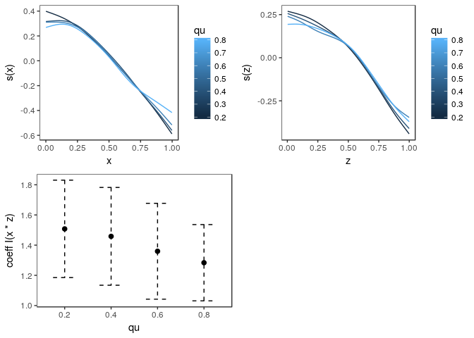

Introducing Modern Generalized Additive Models workshop - docker container and notebooks
========================================================================================

This repository functions mainly to host a dockerfile to facilitate course reproducibility for personal use. It also contains my personal notebooks and notes from the course. Feel free to make use of the provided docker container.

Docker
------

This repository contains a docker file based on the [`rocker\tidyverse`](https://hub.docker.com/r/rocker/tidyverse/) docker image, locked to R version `3.5.0`. Packages are downloaded from an MRAN CRAN snapshot. Run the following in the command line (with an active [docker](https://docs.docker.com/install/) installation running) to pull and run the container.

``` r
## Pull the container
docker pull seabbs/gam-uob-course

docker run -d -p 8888:8787 -e USER=gam -e PASSWORD=gam --name gam seabbs/gam-uob-course
```

The Rstudio server will be found at `localhost:8888`, sign in using the username gam and the password gam.

Preparing for the workshop
--------------------------

*This section is copied from the preparing for the workshop documentation sent ahead of the course.*

The following code should run and produce visualisations. `rgl` cannot be used within Rstudio server as X11 forwarding is not supported. If this functionality is required then ssh into the container, with forwarding, and run `rgl` commands in an R session.

``` r
library(mgcViz)
```

    ## Warning in rgl.init(initValue, onlyNULL): RGL: unable to open X11 display

    ## Warning: 'rgl_init' failed, running with rgl.useNULL = TRUE

``` r
set.seed(2) ## simulate some data...

dat <- gamSim(2,n=500,dist="normal",scale=0.25)$data
```

    ## Bivariate smoothing example

``` r
# Fit GAM and get gamViz object
b <- mqgamV(y~s(x) + s(z) + I(x*z), 
            data = dat, 
            qu = c(0.2, 0.4, 0.6, 0.8),
            aQgam = list(argGam = list(select = TRUE)), aViz = list("nsim" = 0))
```

    ## Estimating learning rate. Each dot corresponds to a loss evaluation. 
    ## qu = 0.4................done 
    ## qu = 0.6..........done 
    ## qu = 0.2............done 
    ## qu = 0.8...................done

``` r
# Either way, we all effects by doing
print(plot(b, allTerms = TRUE), pages = 1)
```


